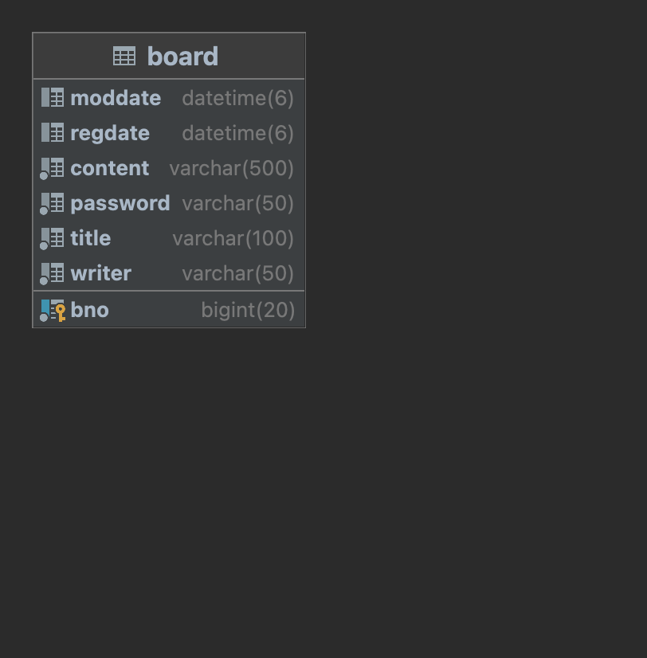

# sparta-board

## 개요
내일배움캠프 스프링 개인과제 part.1

## 프로젝트 소개
스프링부트와 jpa를 이용한 게시판 서비스 
api서버를 만들어보며 실습.

## 프로젝트 구상 과정
1. 스프링 강의에서 만든 메모 프로젝트 레퍼런스로 삼기
2. 도메인 만들기
3. Repository부터 만들고 테스트
4. Service 만들고 테스트
5. Controller 만들기
6. 전체 테스트

# 요구사항
- [ ]  게시글 작성 기능
    - `제목`, `작성자명`, `비밀번호`, `작성 내용`, `작성일`을 저장할 수 있습니다.
    - 저장된 게시글의 정보를 반환 받아 확인할 수 있습니다.
        - 반환 받은 게시글의 정보에 `비밀번호`는 제외 되어있습니다.
- [ ]  선택한 게시글 조회 기능
    - 선택한 게시글의 정보를 조회할 수 있습니다.
        - 반환 받은 게시글의 정보에 `비밀번호`는 제외 되어있습니다.
- [ ]  게시글 목록 조회 기능
    - 등록된 게시글 전체를 조회할 수 있습니다.
        - 반환 받은 게시글의 정보에 `비밀번호`는 제외 되어있습니다.
    - 조회된 게시글 목록은 작성일 기준 내림차순으로 정렬 되어있습니다.
- [ ]  선택한 게시글 수정 기능
    - 선택한 게시글의 `제목`, `작성자명`, `작성 내용`을 수정할 수 있습니다.
        - 서버에 게시글 수정을 요청할 때 `비밀번호`를 함께 전달합니다.
        - 선택한 게시글의 `비밀번호`와 요청할 때 함께 보낸 `비밀번호`가 일치할 경우에만 수정이 가능합니다.
    - 수정된 게시글의 정보를 반환 받아 확인할 수 있습니다.
        - 반환 받은 게시글의 정보에 `비밀번호`는 제외 되어있습니다.
- [ ]  선택한 게시글 삭제 기능
    - 선택한 게시글을 삭제할 수 있습니다.
        - 서버에 게시글 삭제를 요청할 때 `비밀번호`를 함께 전달합니다.
        - 선택한 게시글의 `비밀번호`와 요청할 때 함께 보낸 `비밀번호`가 일치할 경우에만 삭제가 가능합니다.

## 다이어그램

 

## API명세
### Swagger-ui 사용
http://localhost:8080/swagger-ui/index.html

## 프로젝트시 고민한 것들

1. 수정, 삭제 API의 request를 어떤 방식으로 사용 하셨나요? (param, query, body) 
   ㄴ> 수정의 경우 선택된 게시물의 수정사항을 반영하기 위해서 패스워드를 포함한 게시물의 전체 정보를 받았습니다. 
      그리고 리퀘스트에 포함된(사용자가 전송한)비밀번호와 게시물의 실제 비밀번호와 맞는 지 확인하기 위해 pk값도 같이 받아서 조회를 하고 비밀번호를 검사했습니다. 
   ㄴ>삭제의 경우 /{bno}와 같이 받고 바디값으로 사용자가 입력한 비밀번호를 받도록 했습니다. 대조해보고 맞다면 삭제가 이루어지도록 했습니다.   
2. RESTful한 API를 설계하셨나요? 어떤 부분이 그런가요? 어떤 부분이 그렇지 않나요? 
   ㄴ> 1.client-server : 클라이언트가 요청하고 API서버가 응답하고 있습니다. 
   ㄴ> 2.stateless: 클라이언트의 이전 요청을 기억하고있지 않습니다. 
   ㄴ> 3.Cacheable : 제가 만든 프로젝트에선 캐시를 사용하는 부분이 없는 것 같습니다. ETag를 이용하는 방법을 공부해보려 합니다. 
   ㄴ>  rest스타일 중 self-descriptive와 HATEOAS를 지키지 못했습니다.  
3. 적절한 관심사 분리를 적용하셨나요? (Controller, Service, Repository) 
   ㄴ> 컨트롤러는 관심사를 클라이언트의 요청을 처리하는데 중점을 두고 있고 예외 처리도 네트워크 요청과 응답의 관점으로 보고있고 나머지 계층은 자바 내부에서 일어나는 예외로 보고 있다고 생각합니다. 
   ㄴ> 서비스는 제가 만든 서비스를 수행하는데 주요한 로직들을 담고 있습니다. 자료를 읽어오고 저장하고 삭제하는 등의 기능을 구현했습니다. 
   ㄴ> 레포지토리는 서비스에서 호출되어 실제로 데이터 베이스에 접근하여 여러 작업들을 수행하고 있습니다. 
4. API 명세서 작성 가이드라인을 검색하여 직접 작성한 API 명세서와 비교해보세요! 
   ㄴ> 저는 Swagger를 사용했는데 명세서의 요소들을 자동으로 만들어준 것을 사용했습니다. 
   
* 비밀번호를 체크하는 로직을 서비스 수정/삭제메소드안에 포함시켜야할까 고민했습니다. 컨트롤러에 수정 요청이 들어오면 service.modify()를 실행하고 서비스 내부에서 알아서 다 해주는 게 맞는걸까 
아니면 따로 비밀번호를 체크하는 메소드를 만들어서 컨트롤러에서 실행시켜야할까 고민했습니다. 아직 확신이 안듭니다. 사용자의 요청에 따른 분기는 컨트롤러가 해주는 게 맞다는 생각이 드는데 서비스는 비즈니스 로직을 담고있으니 
컨트롤러는 수정요청을 받고 서비스에게 전체를 위임하고 서비스가 처리한 결과에 따라 분기를 해줘야 하는건지 모르겠습니다.
* 컨트롤러 예외처리 부분이 깔끔하지 않은 것 같습니다. api서버에서 잘못된 응답에 대해서 어떤 메시지를 주는지 공부해봐야겠습니다.
* 게시글 등록시 받아오는 dto의 필드에 수정날짜를 빼야할까 고민했습니다. 처음 등록하는 요청이기 때문에 수정일자 필드가 필요할까 생각을 했습니다.
* 게시판을 실제 api로만 서비스한다면 어떻게 해야할까 고민했습니다. 수정요청에 id값과 비밀번호를 전송하고 만약 비밀번호가 일치한다면 토큰같은 걸 주고 수정권한을 주는 건 어떨까 생각해봤습니다.

